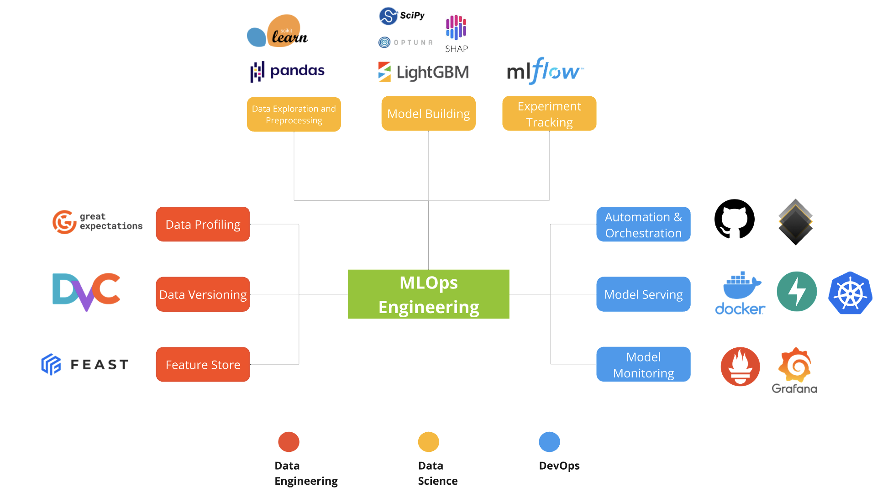

# 🏗️ Concrete Compressive Strength Prediction and Optimization

## About

Use Case: XYZ Cement Factory is a leading manufacturer of cement products. Recently, the company has received feedback from its clients about the inconsistent strength of its cement. To maintain its reputation and ensure customer satisfaction, XYZ Cement Factory has decided to invest in optimizing the cement strength.

Goal: Predict the compressive strength of concrete based on the mixture of ingredients and optimize the mixture of ingredients to maximize the compressive strength of concrete.

Data Reference: [Kaggle](https://www.kaggle.com/datasets/elikplim/concrete-compressive-strength-data-set)

## Tech Stack

The tech stack of this project is divided into three main categories:

| Category                        | Tools/Technologies                                      | Remarks                                         |
| ------------------------------- | ------------------------------------------------------- | ----------------------------------------------- |
| **DataOps (Data Engineering)**  | Data Profiling: Great Expectations                      | Ensures data quality and consistency            |
|                                 | Data Versioning: DVC                                    | Manages data and model versioning               |
|                                 | Feature Store: Feast                                    | Centralized repository for features             |
| **MLOps (Machine Learning)**    | Exploratory Data Analysis: Pandas, Scikit-learn         | Data manipulation and initial analysis          |
|                                 | Model Development: Scikit-learn, LightGBM, SHAP, Optuna | Building, tuning, and interpreting models       |
|                                 | Experiment Tracking: MLflow                             | Tracks and manages machine learning experiments |
| **DevOps (DevOps Engineering)** | DevOps Automation: GitHub Actions                       | Automates CI/CD pipelines                       |
|                                 | Serving: FastAPI, Docker, Kubernetes                    | Deploys and scales machine learning models      |
|                                 | Monitoring: Prometheus, Grafana                         | Monitors system performance and health          |

## Configuration

#### Git

- To re-enable git ssh key and its connection to GitHub:
  - `ssh-add -K <path to private key>`
